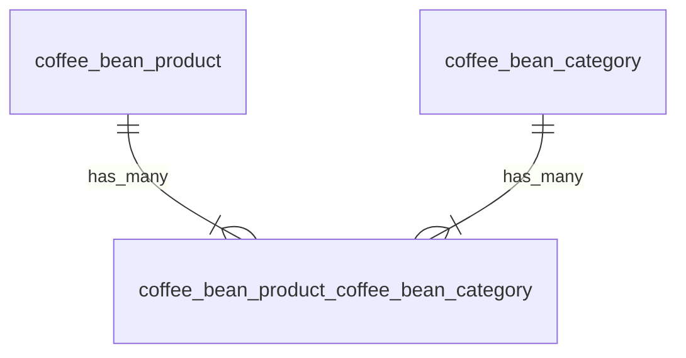
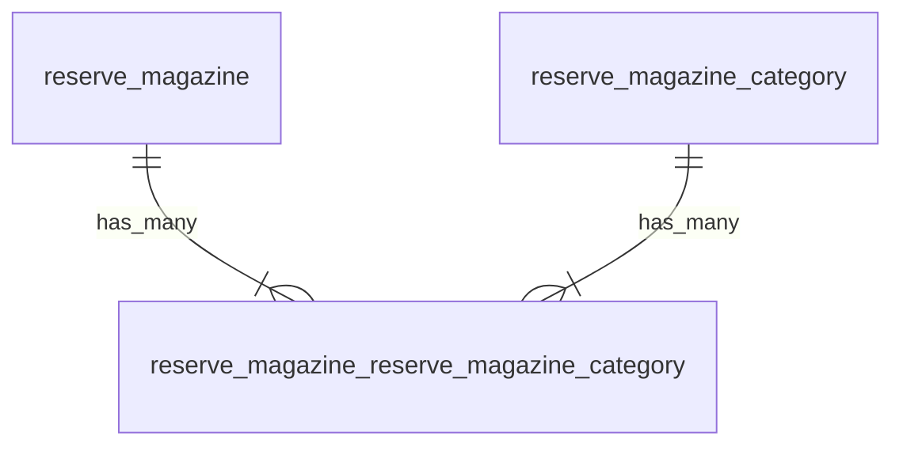
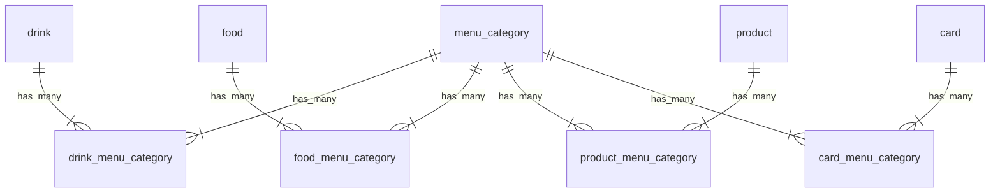

# 테이블
## 커피 원두
- coffee_bean_product테이블
  - id
  - 이름
- coffee_bean_category테이블
  - id
  - 이름
- coffee_bean_product_coffee_bean_category테이블
  - id
  - coffee_bean_product_id
  - coffee_bean_category_id

## reserve magazine
- reserve_magazine테이블
  - id
  - 이름
- reserve_magazine_category테이블
  - id
  - 이름
- reserve_magazine_reserve_magazine_category테이블
  - id
  - reserve_magazine_id
  - reserve_magazine_category_id

## 상품
- drink테이블
  - id
  - 이름
- food테이블
  - id
  - 이름
- product테이블
  - id
  - 이름
- card테이블
  - id
  - 이름
- menu_category테이블
  - id
  - 이름
- drink_menu_category테이블
  - id
  - drink_id
  - menu_category_id
- food_menu_category테이블
  - id
  - food_id
  - menu_category_id
- product_menu_category테이블
  - id
  - product_id
  - menu_category_id
- card_menu_category테이블
  - id
  - product_id
  - menu_category_id

# 요건 
- coffee/product_list를 원두, 비아, 캡슐로 구분해야 한다
- coffee/reserve_magazine_list를 PEOPLE, COFFEE, PLACES, EXPERIENCE로 구분해야 한다
- coffee/espresso.do를 도피오, 에스프레소 마키아또, 아메리카노, 마키아또, 카푸치노, 라떼, 모카로 구분해야 한다?
  - 관련 제품 이 있다. 
    - /menu/ 에 나오는 상품들 중에서 선택된다.
    - 관련 제품의 선택을 테이블로 관리해야하나?
      - 도피오, 에스프레소 마키아또, 아메리카노, 마키아또, 카푸치노, 라떼, 모카를 테이블로 관리가 불필요할수도있다. 그러므로 어플리케이션에서 각 page에 리다이렉트 링크를 설정하는걸로 충분할 수 있다.
      - 에스프레스 음료를 도피오, 에스프레소 마키아또, 아메리카노, 마키아또, 카푸치노, 라떼, 모카로 나누고 설명하기는 했지만, 관련 제품 몇개만 보여줬을뿐이다. /menu/ 에 나오는 상품들을 종류별로 구분한것이 더 구체적이다. 그러므로 테이블이 필요 없을수도 있다.
- /menu/ 의 상품들을 종류별로 구분해야 한다.
  - 음료
    - 콜드 브루
      - https://www.starbucks.co.kr/menu/drink_list.do?CATE_CD=product_cold_brew
    - 브루드 커피
      - https://www.starbucks.co.kr/menu/drink_list.do?CATE_CD=product_brewed
    - 에스프레소
      - https://www.starbucks.co.kr/menu/drink_list.do?CATE_CD=product_espresso
    - 프라푸치노
      - https://www.starbucks.co.kr/menu/drink_list.do?CATE_CD=product_frappuccino
    - 블렌디드
      - https://www.starbucks.co.kr/menu/drink_list.do?CATE_CD=product_blended
    - 스타벅스 리프레셔
      - https://www.starbucks.co.kr/menu/drink_list.do?CATE_CD=product_refresher
    - 스타벅스 피지오
      - https://www.starbucks.co.kr/menu/drink_list.do?CATE_CD=product_fizzio
    - 티(티바나)
      - https://www.starbucks.co.kr/menu/drink_list.do?CATE_CD=product_tea
    - 기타 제조 음료
      - https://www.starbucks.co.kr/menu/drink_list.do?CATE_CD=product_etc
    - 스타벅스 주스(병음료)
      - https://www.starbucks.co.kr/menu/drink_list.do?CATE_CD=product_juice
  - 푸드
    - 브레드
      - https://www.starbucks.co.kr/menu/food_list.do?CATE_CD=product_bakery
    - 케이크
      - https://www.starbucks.co.kr/menu/food_list.do?CATE_CD=product_cake
    - 샌드위치 & 샐러드
      - https://www.starbucks.co.kr/menu/food_list.do?CATE_CD=product_sandwich
    - 따뜻한 푸드
      - https://www.starbucks.co.kr/menu/food_list.do?CATE_CD=product_hot_food
    - 과일 & 요거트
      - https://www.starbucks.co.kr/menu/food_list.do?CATE_CD=product_fruit_yogurt
    - 스낵 & 미니 디저트
      - https://www.starbucks.co.kr/menu/food_list.do?CATE_CD=product_snack
    - 아이스크림
      - https://www.starbucks.co.kr/menu/food_list.do?CATE_CD=product_icecream
  - 상품
    - 머그
      - https://www.starbucks.co.kr/menu/product_list.do?CATE_CD=product_mug
    - 글라스
      - https://www.starbucks.co.kr/menu/product_list.do?CATE_CD=product_glass
    - 플라스틱 텀블러
      - https://www.starbucks.co.kr/menu/product_list.do?CATE_CD=product_plastic
    - 스테인리스 텀블러
      - https://www.starbucks.co.kr/menu/product_list.do?CATE_CD=product_stainless
    - 보온병
      - https://www.starbucks.co.kr/menu/product_list.do?CATE_CD=product_vacuum
    - 액세서리
      - https://www.starbucks.co.kr/menu/product_list.do?CATE_CD=product_accessories
    - 선물세트
      - https://www.starbucks.co.kr/menu/product_list.do?CATE_CD=product_present
    - 커피 용품
      - https://www.starbucks.co.kr/menu/product_list.do?CATE_CD=product_coffee
    - 패키지 티(티바나)
      - https://www.starbucks.co.kr/menu/product_list.do?CATE_CD=product_teaPackage
    - 시럽
      - https://www.starbucks.co.kr/menu/product_list.do?CATE_CD=product_syrup
  - 카드
    - 실물카드
      - https://www.starbucks.co.kr/menu/card_list.do?CATE_CD=product_offline
    - e-Gift 카드
      - https://www.starbucks.co.kr/menu/card_list.do?CATE_CD=product_egift
