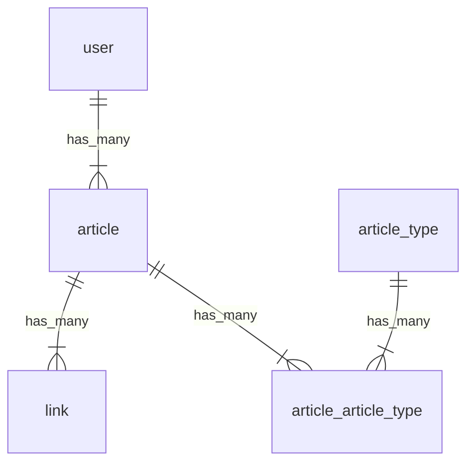

# 테이블
- user 테이블
  - id
  - 이름

- article 테이블
  - id
  - 제목
  - 내용
  - user_id(작성자)

- article_type 테이블
  - id
  - 기사 분류 이름

- article_article_type 테이블(Related Post)
  - id
  - article_id
  - article_type_id

- link 테이블
  - id
  - url
  - article_id

# 요건 
- 기사를 나열해서 보여준다
- 기사의 제목이나, 기사 내용으로 검색할 수 있다
- 기사는 내용, 작성자, 링크들(해당 기사 공유용, facebook용, X용, social-plugins용, hatena용), Related Post를 포함해야 한다
