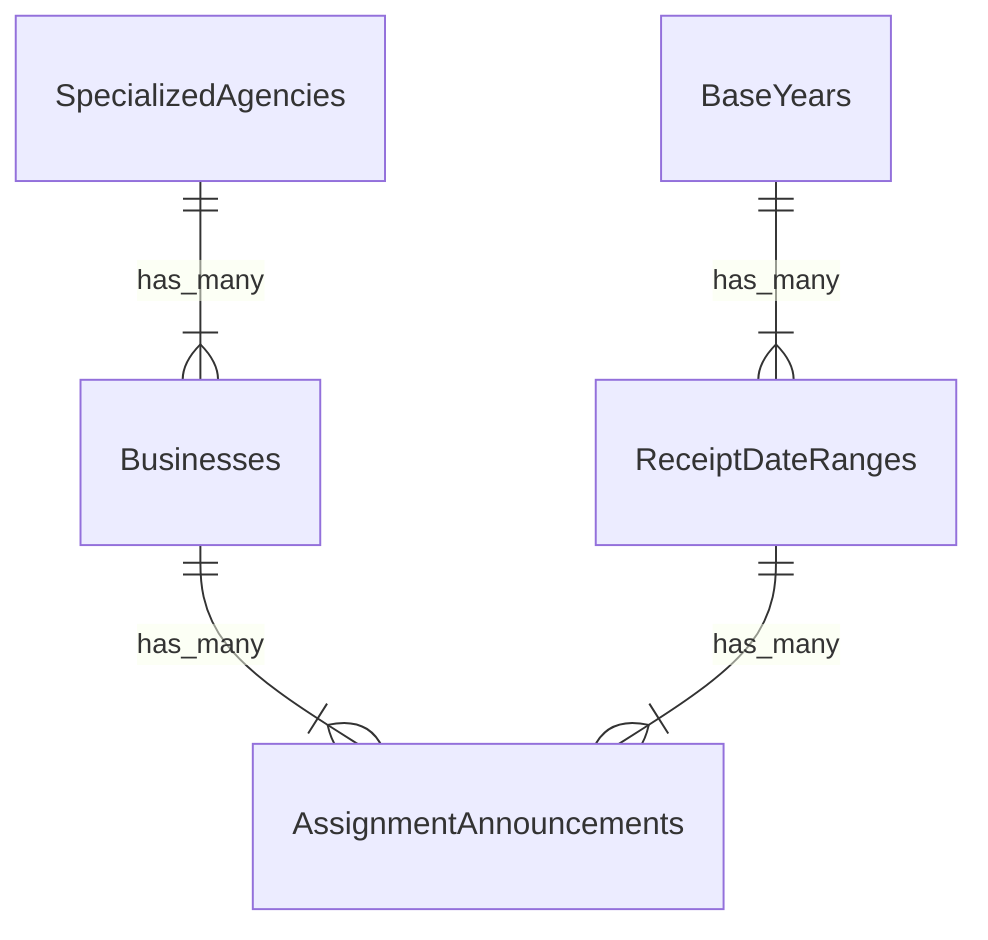

# 산림청_참여연구기관_과제접수(과제공고)
- 공공데이터포털
  - https://www.data.go.kr/data/15091874/fileData.do
- CSV에 제시된 애트리뷰트
  - 공고번호, 기준년도, 공고명, 사업명, 전문기관명, 접수시작일, 접수마감일, 세부사업명

## 테이블(1차 정리)
- 공고번호을 기본키라고 가정하고 정규화를 해본다.

### 과제공고(AssignmentAnnouncements)
- 종속성
  - 공고번호 -> 공고명, 기준년도, 사업명, 전문기관명, 접수시작일, 접수마감일, 세부사업명
- 1NF
  - `사업명` 과 `세부사업명` 이 만족하지 않는다. 중복인 `세부사업명` 삭제

## 테이블(2차 정리)

### 과제공고(AssignmentAnnouncements)
- 종속성
  - 공고번호 -> 공고명, 기준년도, 사업명, 전문기관명, 접수시작일, 접수마감일
- 1NF
  - 만족한다고 판단
- 2NF
  - 만족한다고 판단, 부분 함수 종속이 없다
- 3NF
  - 이행 함수 종속 발견
  - 전문기관명 -> 사업명 -> 공고번호 라고 생각한다.
    - 전문기관이 사업을 만들고, 사업안에서 공고가 생길거라고 생각한다
    - 전문기관명 -> 사업명, 사업명 -> 공고번호로 분리한다
  - 공고번호 -> {접수시작일, 접수마감일} -> 기준년도 라고 생각 할 수도 있다
    - 새로운 공고를 만드는 과정을 다음과 같다고 추측했습니다
      - 전문기관이 과제 공고의 내용을 정하고, `{접수시작일, 접수마감일}` 을 정한다
      - `{접수시작일, 접수마감일}` 을 정하고 나서 어떤 기준년도에 해당하는지를 확인하고
      - 최종적으로 공고가 되서 공고번호가 생긴다.
    - `접수시작일, 접수마감일이 2019년 11월 이전이면 2019년도` 라고 가정했다
    - 공고번호 -> {접수시작일, 접수마감일}, {접수시작일, 접수마감일} -> 기준년도 로 분리한다

## 테이블(3차 정리)

### 과제공고(AssignmentAnnouncements)
- 종속성
  - 공고번호 -> 공고명, 사업id, 접수일id
- 1NF, 2NF, 3NF, BCNF
  - 만족한다고 판단

### 전문기관(SpecializedAgencies)
- 종속성
  - 전문기관id -> 이름
- 1NF, 2NF, 3NF, BCNF
  - 만족한다고 판단

### 사업(Businesses)
- 종속성
  - 사업id -> 이름, 전문기관id
- 1NF, 2NF, 3NF, BCNF
  - 만족한다고 판단

### 기준년도(BaseYears)
- 종속성
  - 기준년도id -> 년도
- 1NF, 2NF, 3NF, BCNF
  - 만족한다고 판단

### 접수일(ReceiptDateRanges)
- 종속성
  - 접수일id -> 접수시작일, 접수마감일, 기준년도id
- 1NF, 2NF, 3NF, BCNF
  - 만족한다고 판단


## 3차 정리의 이상현상 검토
- `테이블(3차 정리)` 형태에서 `공고번호, 공고명, 기준년도, 사업명, 전문기관명, 접수시작일, 접수마감일` 항목들을 검토한다.
- 삽입이상, 수정이상, 삭제이상이 발생하였다. 수정이 필요하다.
### 삽입이상
- 없음
  - 공고번호를 추가할때, 공고명, 사업id, 접수일id을 추가해야 한다. 나머지 3항목은 종속된 항목이라 필요한 추가이다.
  - 공고명은 공고번호에 종속이라 단독 추가는 없다고 판단했다.
  - 기준년도(BaseYears의 년도)는 테이블 안에서 단독 애트리뷰트라 문제없다
  - 사업명(Businesses의 이름)은 테이블 안에서 단독 애트리뷰트라 문제없다
  - 전문기관명(SpecializedAgencies의 이름)은 테이블 안에서 단독 애트리뷰트라 문제없다
  - 접수시작일을 추가할때, 접수마감일, 기준년도id를 추가해야 한다. 나머지 2항목은 종속된 항목이라 필요한 추가이다.
### 수정이상
- 없음
  - 공고번호를 수정할때, 여러 레코드를 수정하지 않아도 된다.
  - 공고명을 수정할때, 여러 레코드를 수정하지 않아도 된다.
  - 기준년도(BaseYears의 년도)를 수정할때, 여러 레코드를 수정하지 않아도 된다.
  - 사업명(Businesses의 이름)를 수정할때, 여러 레코드를 수정하지 않아도 된다.
  - 전문기관명(SpecializedAgencies의 이름)를 수정할때, 여러 레코드를 수정하지 않아도 된다.
  - 접수시작일이나 접수마감일을 수정할때, 여러 레코드를 수정하지 않아도 된다.
### 삭제이상
- 없음
  - 과제공고 테이블의 레코드를 삭제하면, 공고명이 삭제된다. 나머지는 참조용id라서 문제없다
  - 전문기관 테이블의 레코드를 삭제하면, 이름이 삭제된다. 문제없다
  - 사업 테이블의 레코드를 삭제하면, 이름이 삭제된다. 나머지는 참조용id라서 문제없다
  - 기준년도 테이블의 레코드를 삭제하면, 년도가 삭제된다. 문제없다
  - 접수일 테이블의 레코드를 삭제하면, 접수시작일과 접수마감일이 삭제된다. 
    - 접수시작일과 접수마감일은 한묶음이니 같이 삭제되도 문제없다.
    - 기준년도id는 참조용id라서 문제없다

## Rails 명령어
### 초기 설정에 사용했던 명령어
```
cd $REPOSITORY_ROOT/r_15091874
rails new . -d postgresql
# Gemfile에 gem 'rspec-rails', '~> 6.0.0' 추가
bundle config set --local path './vendor'
bundle install
bundle exec rails generate rspec:install
bundle exec rails db:create db:migrate
```

### model과 migration파일 작성할때 사용했던 명령어
### 과제공고(AssignmentAnnouncements)
- 종속성
  - 공고번호 -> 공고명, 사업id, 접수일id
### 전문기관(SpecializedAgencies)
- 종속성
  - 전문기관id -> 이름
### 사업(Businesses)
- 종속성
  - 사업id -> 이름, 전문기관id
### 기준년도(BaseYears)
- 종속성
  - 기준년도id -> 년도
### 접수일(ReceiptDateRanges)
- 종속성
  - 접수일id -> 접수시작일, 접수마감일, 기준년도id

```
cd $REPOSITORY_ROOT/r_15091874
# 과제공고(AssignmentAnnouncements)
bundle exec rails generate model AssignmentAnnouncement name:string business:belongs_to receipt_date_range business:belongs_to
# 전문기관(SpecializedAgencies)
bundle exec rails generate model SpecializedAgency name:string
# 사업(Businesses)
bundle exec rails generate model Business name:string specialized_agency:belongs_to
# 기준년도(BaseYears)
bundle exec rails generate model BaseYear year:integer
# 접수일(ReceiptDateRanges)
bundle exec rails generate model ReceiptDateRange ReceiptStartDate:datetime ReceiptEndDate:datetime base_year:belongs_to
```

### rspec 실행 명령어
```
cd $REPOSITORY_ROOT/r_15091874
bundle exec rspec --format documentation
```