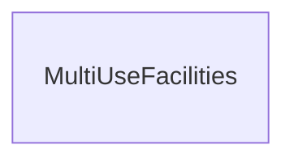
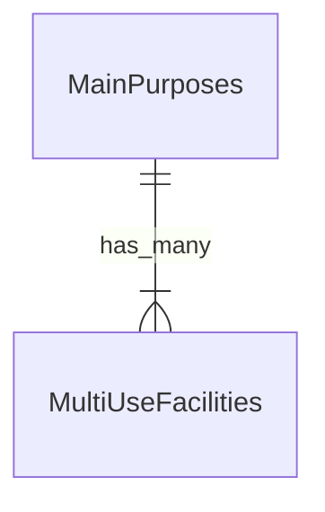
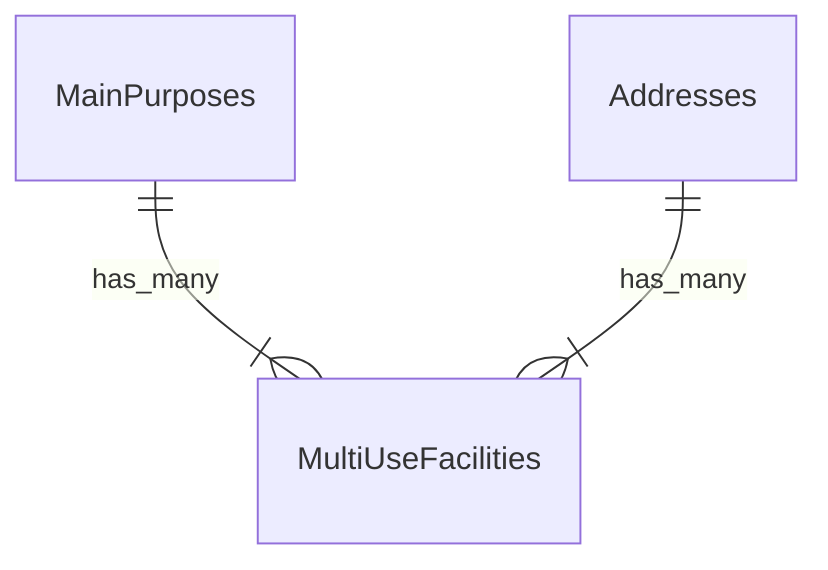

# 부산광역시 해운대구_다중이용시설 현황
- 공공데이터포털
  - https://www.data.go.kr/data/3075796/fileData.do
- CSV에 제시된 애트리뷰트
  - 연번, 시설명, 소재지, 주용도, 연면적(제곱미터)

## 테이블(1차 정리)
- 연번은 무시.
- 시설명을 기본키라고 가정하고 정규화를 해본다.


### 다중이용시설(MultiUseFacilities)
- 종속성
  - 시설명 -> 소재지, 주용도, 연면적
- 1NF
  - `시설명` 이 만족하지 않는다고 판단.
  - `JB디자인호텔(구.블루문)` 은 `JB디자인호텔` 와 `(구.블루문)` 를 가지고 있다.
  - 레코드를 별도로 추가하면 같은 위치에 건물이 2개 있다고 오해할 수 있다.
  - 그러므로 `보충설명` 애트리뷰트를 추가한다

## 테이블(2차 정리)


### 다중이용시설(MultiUseFacilities)
- 종속성
  - 시설명 -> 소재지, 보충설명, 주용도, 연면적
- 2NF
  - 만족한다고 판단
  - 부분 함수 종속이 없다
- 3NF
  - 만족한다고 판단
  - 이행 함수 종속이 없다
- BCNF
  - `주용도` 가 만족하지 않는다고 판단
  - 시설명에 주용도를 부여하는건 데이터 작성자의 판단이라고 생각하기 때문이다. 
  - 그러므로 `주용도` 테이블을 별도로 만든다

## 테이블(3차 정리)


### 다중이용시설(MultiUseFacilities)
- 종속성
  - 시설명 -> 소재지, 보충설명, 연면적
- BCNF까지
  - 만족한다고 판단
- 관계
  - 다중이용시설 |}--|| 주용도
### 주용도(MainPurposes)
- 종속성
  - 주용도
- 애트리뷰트가 1개, 1NF 만족한다고 판단
- 관계
  - 주용도 ||--{| 다중이용시설

## 3차 정리의 이상현상 검토
- `테이블(3차 정리)` 형태에서 `시설명, 소재지, 보충설명, 연면적, 주용도` 항목들을 검토한다.
- 삽입이상, 수정이상, 삭제이상이 발생하였다. 수정이 필요하다.
### 삽입이상
- 없음
  - 시설명을 추가할때, 소재지, 보충설명, 연면적을 추가해야 한다. 나머지 3항목은 종속된 항목이라 필요한 추가이다.
  - 보충설명과 연면적은 시설명에 종속이라 단독 추가는 없다고 판단했다.
  - 주용도는 주용도 항목 하나라 이상이 발생하지 않는다
- 있음
  - 소재지를 추가할때, 시설명이 없을수도 있다. 소재지(주소)는 생겼는데 건물이 아직 없는경우.
### 수정이상
- 없음
  - 시설명을 수정할때, 여러 레코드를 수정하지 않아도 된다.
  - 보충설명을 수정할때, 여러 레코드를 수정하지 않아도 된다.
    - 해당 레코드만의 값이기 때문에 수정이상이라고 보기 어렵다.
  - 연면적을 수정할때, 여러 레코드를 수정하지 않아도 된다.
    - 해당 레코드만의 값이기 때문에 수정이상이라고 보기 어렵다.
- 있음
  - 소재지를 수정할때, 여러 레코드를 수정해야한다. 소재지에 적는 주소값이 상세주소(예 : 동, 층, 호)를 포함하지 않기때문에 같은 소재지 값이 여러 레코드에 있을 수 있다.
### 삭제이상
- 없음
  - 주용도 테이블의 레코드를 삭제하면, 주용도만 삭제된다. 이상없다
- 있음
  - 다중이용시설 테이블의 레코드를 삭제하면, 시설명, 소재지, 보충설명, 연면적이 삭제된다. 시설명, 보충설명, 연면적은 레코드 고유값이기 때문에 문제가 없지만, 소재지는 이상이 발생한다.
    - 레코드1에 소재지 `부산광역시 해운대구 센텀동로 6` 이 유일하게 존재했다면, 시설명만 삭제하려고 했는데 의도치않게 소재지의 유일한 값을 지우게 된다.

## 테이블(4차 정리)
삽입이상, 수정이상, 삭제이상이 발생한 `소재지` 를 별도의 테이블로 분리해서 해소한다.


### 다중이용시설(MultiUseFacilities)
- 종속성
  - 시설명 -> 보충설명, 연면적
- BCNF까지
  - 만족한다고 판단
- 관계
  - 다중이용시설 |}--|| 주용도
### 주용도(MainPurposes)
- 종속성
  - 주용도
- 애트리뷰트가 1개, 1NF 만족한다고 판단
- 관계
  - 주용도 ||--{| 다중이용시설
### 소재지(Addresses)
- 종속성
  - 소재지
- 애트리뷰트가 1개, 1NF 만족한다고 판단
- 관계
  - 소재지 ||--{| 다중이용시설

## 4차 정리의 이상현상 검토
- 삽입이상
  - `소재지` 를 별도의 테이블로 분리해서 해소했다.
- 갱신이상
  - `소재지` 를 별도의 테이블로 분리해서 해소했다.
- 삭제이상
  - `소재지` 를 별도의 테이블로 분리해서 해소했다.


## Rails 명령어
### 초기 설정에 사용했던 명령어
```
cd $REPOSITORY_ROOT/r_3075796
rails new . -d postgresql
# Gemfile에 gem 'rspec-rails', '~> 6.0.0' 추가
bundle config set --local path './vendor'
bundle install
bundle exec rails generate rspec:install
bundle exec rails db:create db:migrate
```

### model과 migration파일 작성할때 사용했던 명령어
```
cd $REPOSITORY_ROOT/r_3075796
# 주용도(MainPurposes)
bundle exec rails generate model MainPurpose purpose:string
# 소재지(Addresses)
bundle exec rails generate model Address address:string
# 다중이용시설(MultiUseFacilities)
bundle exec rails generate model MultiUseFacility name:string total_floor_area:string description:string main_purpose:belongs_to address:belongs_to
```

bundle exec rails generate model AAA name:string:nil

### rspec 실행 명령어
```
cd $REPOSITORY_ROOT/r_3075796
bundle exec rspec --format documentation
```